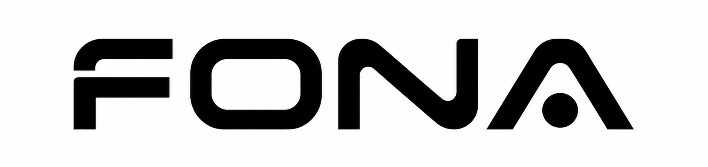

<p align="center">
  <picture>
    <source media="(prefers-color-scheme: dark)" srcset="assets/brand/fona-black.png">
    <source media="(prefers-color-scheme: light)" srcset="assets/brand/fona-white.png">
    
  </picture>
</p>

<h1 align="center">FONA</h1>

<p align="center">
  <strong>Finance Open Network Archive.</strong><br>
  Local-first PIT market data infrastructure for survivorship-reduced U.S. equity backtesting.
</p>

<p align="center">
  <a href="docs/ARCHITECTURE.md#canonical-merge"></a>
  <a href="docs/DATA_DICTIONARY.md#daily_prices"></a>
  <a href="docs/COVERAGE.md#latest-classification-coverage"></a>
  <a href="docs/COVERAGE.md#latest-local-coverage"></a>
  <a href="tests/"></a>
</p>

FONA, the Finance Open Network Archive, builds a local market-data layer for backtests that need more than today's surviving tickers. It combines SEC-led delisting discovery, recoverable historical daily bars, security classification, liquidity metrics, and a date-by-date tradable universe into one auditable DuckDB database.

This repository contains the pipeline, tests, documentation, and brand assets. Generated market data, raw vendor/API responses, DuckDB files, and secrets stay local and are intentionally ignored by Git.

## What You Get

| Capability | Delivered artifact |
| --- | --- |
| PIT-style daily OHLCV | `daily_prices` with `date + symbol` grain |
| Active and delisted coverage | Active Yahoo bars plus SEC-candidate Yahoo recovery and Kaggle delisted archive |
| Security classification | `security_master` with stock/ETF/fund classification, exchange, CIK, SIC, sector, and industry fields |
| Backtest universe | `universe_membership` rebuilt daily from price, volume, ADV20, and next-open eligibility |
| Lifecycle-adjusted universe | `backtest_universe_membership` removes symbols after trusted delisting events |
| Delisting outcome layer | `delisting_outcomes` classifies selected Form 25 exits and captures SEC cash consideration when extractable |
| Valid terminal-event subset | `valid_terminal_events` filters raw terminal hints to liquidation-safe events |
| Symbol alias map | `symbol_aliases` records curated ticker-change windows such as `FI -> FISV` |
| Corporate-action evidence | `corporate_action_evidence` stores click-through SEC, Nasdaq Trader, and issuer IR sources for known split/news cases |
| Return-quality guardrail | `return_quality_flags` marks split-like, scale-error, and event-risk daily returns before they pollute backtests |
| Liquidity features | `liquidity_metrics` with raw and quality-filtered dollar volume, ADV20, traded days, and next open |
| Quality gates | Unit tests, hard daily-bar audit, price-quality flags, and annual listing/delisting flow audit |

## Data Product Snapshot

Latest local build:

| Metric | Value |
| --- | ---: |
| Final database | `data/pit_market.duckdb` |
| Price date range | 2010-01-01 to 2026-06-11 |
| Daily price rows | 24,007,243 |
| Priced symbols | 11,813 |
| Active-source symbols | 10,031 |
| Delisted-source symbols | 1,782 |
| Trading dates | 4,249 |
| Universe date range | 2010-01-25 to 2026-06-10 |
| Universe memberships | 13,431,989 |
| Lifecycle-adjusted memberships | 12,865,698 |
| Security lifecycle events | 13,645 |
| Terminal delisting events | 1,778 |
| Delisting outcomes | 1,778 |
| Delisting outcomes with exit value | 1,025 |
| Valid terminal events | 610 |
| Symbol aliases | 1 |
| Corporate-action evidence rows | 16 |
| Return quality flags | 1,661 |
| Return exclusion candidates | 1,479 |
| SEC Form 25 outcome docs parsed | 1,751 |
| Price quality flags | 192,862 |
| Median daily universe size | 2,991 |

Security classification:

| Classification | Symbols |
| --- | ---: |
| Stock | 6,921 |
| ETF | 4,871 |
| Unknown | 18 |
| Fund | 3 |
| CIK enriched | 7,458 |
| SIC enriched | 7,152 |
| Sector/industry enriched | 7,232 |
| Stock sector/industry coverage | 95.88% |

SEC-led delisting discovery:

| Area | Value |
| --- | ---: |
| SEC Form 25/25-NSE filings | 28,144 |
| SEC delisting CIKs | 8,731 |
| SEC candidate tickers | 10,962 |
| Yahoo delisted raw cache inspected | 4,441 |
| Yahoo equity/ETF/USD cache accepted | 1,813 |
| Yahoo non-equity/non-USD/empty cache rejected | 2,628 |

## Inside The DuckDB

| Table | Rows | Grain | What is inside |
| --- | ---: | --- | --- |
| `daily_prices` | 24,007,243 | `date, symbol` | Canonical OHLCV bars, adjusted close, source, delisted-source flag |
| `symbol_master` | 11,813 | `symbol` | First/last price date, source list, active/delisted coverage flags |
| `security_master` | 11,813 | `symbol` | Asset type, ETF flag, instrument type, name, exchange, currency, CIK, SIC, sector, industry |
| `liquidity_metrics` | 24,007,243 | `date, symbol` | Raw and quality-filtered dollar volume, ADV20, traded days, global-calendar next open |
| `price_quality_flags` | 192,862 | `date, symbol` | Rows excluded from tradable universe construction by quality rules |
| `universe_membership` | 13,431,989 | `date, universe, symbol` | Tradable universe membership by date |
| `universe_stats` | 4,232 | `date, universe` | Daily sanity metrics for universe size, median close, ADV, and volume |
| `security_events` | 13,645 | `symbol, event` | Listing and delisting lifecycle events from price coverage, FMP, and SEC |
| `terminal_events` | 1,778 | `symbol, event_date` | Last available terminal close on or before delisting event; no zero fill |
| `delisting_outcomes` | 1,778 | `symbol, event_date` | SEC Form 25 outcome class, effective date, observed exit price, cash consideration, and selected exit value |
| `terminal_event_validity` | 1,778 | `symbol, event_date` | Terminal-event safety audit against later prices and universe membership |
| `valid_terminal_events` | 610 | `symbol, event_date` | Liquidation-safe subset of terminal events |
| `symbol_aliases` | 1 | `alias_symbol, date range` | Curated ticker-change alias windows |
| `corporate_action_evidence` | 16 | `symbol, event_date, event_type` | Verifiable source URLs for known reverse splits, reference-price guards, news spikes, and suspensions |
| `return_quality_flags` | 1,661 | `date, symbol` | Extreme daily returns classified as exclusion candidates, event risk, or manual review |
| `backtest_universe_membership` | 12,865,698 | `date, universe, symbol` | Lifecycle-adjusted backtest universe excluding post-delisting dates and clean-return exclusions |

Price-bar source coverage:

| Source | Rows | Symbols | Range |
| --- | ---: | ---: | --- |
| `yahoo_fallback` | 20,323,995 | 10,031 | 2010-01-04 to 2026-06-11 |
| `yahoo_delisted_probe` | 3,649,850 | 1,767 | 2010-01-04 to 2026-06-11 |
| `kaggle_arandkei_delisted` | 33,398 | 15 | 2010-01-01 to 2026-02-23 |

## Sample Records

`daily_prices`:

| date | symbol | open | high | low | close | volume | source | delisted |
| --- | --- | ---: | ---: | ---: | ---: | ---: | --- | --- |
| 2026-06-10 | BINI | 0.08 | 0.09 | 0.06 | 0.08 | 17,400 | `yahoo_delisted_probe` | true |
| 2026-06-10 | DIDIY | 3.48 | 3.60 | 3.48 | 3.58 | 15,635,100 | `yahoo_delisted_probe` | true |
| 2026-06-10 | SPY | 733.39 | 738.38 | 725.33 | 725.43 | 59,800,600 | `yahoo_fallback` | false |
| 2026-06-09 | AAPL | 300.28 | 300.75 | 287.78 | 290.55 | 70,108,800 | `yahoo_fallback` | false |
| 2026-06-08 | BINI | 0.06 | 0.07 | 0.05 | 0.06 | 26,600 | `yahoo_delisted_probe` | true |

`security_master`:

| symbol | asset_type | is_etf | instrument_type | security_name | exchange | cik | sic | sector | industry |
| --- | --- | --- | --- | --- | --- | ---: | ---: | --- | --- |
| AAPL | stock | false | EQUITY | Apple Inc. | NASDAQ | 320193 | 3571 | Technology | Consumer Electronics |
| BINI | stock | false | EQUITY | Bollinger Innovations, Inc. | OTC Markets OTCPK | 1499961 | 3711 | Consumer Cyclical | Motor Vehicles & Passenger Car Bodies |
| DIDIY | stock | false | EQUITY | DiDi Global Inc. | OTC Markets OTCPK | 1764757 | 7389 | Industrials | Services-Business Services, NEC |
| SPY | etf | true | ETF | State Street SPDR S&P 500 ETF Trust | NYSEArca | 884394 |  |  |  |
| XOM | stock | false | EQUITY | Exxon Mobil Corporation | NYSE | 34088 | 2911 | Energy | Petroleum Refining |

## Query Contract

Python helpers:

```python
from src.db.query_examples import (
    get_backtest_universe,
    get_corporate_action_evidence,
    get_delisting_outcomes,
    get_price_panel,
    get_prices,
    get_return_quality_flags,
    get_security_master,
    get_symbol_aliases,
    get_universe,
    get_valid_terminal_events,
)

symbols = get_universe("2020-01-02")
backtest_symbols = get_backtest_universe("2020-01-02")
prices = get_prices("2020-01-02", symbols[:100])
panel = get_price_panel("2020-01-02", "2020-03-31")
metadata = get_security_master(symbols[:100])
outcomes = get_delisting_outcomes(["SY", "IDC", "AMN"])
valid_terminals = get_valid_terminal_events()
aliases = get_symbol_aliases(["FI"])
evidence = get_corporate_action_evidence(["COSM", "TTOO", "SCE.PN"])
return_flags = get_return_quality_flags(["COSM", "TPST"], only_exclusions=False)
```

Direct DuckDB:

```sql
SELECT
    p.date,
    p.symbol,
    sm.asset_type,
    sm.sector,
    p.close,
    l.quality_adv20,
    l.next_open
FROM universe_membership u
JOIN daily_prices p USING (date, symbol)
JOIN liquidity_metrics l USING (date, symbol)
LEFT JOIN security_master sm USING (symbol)
WHERE u.date = DATE '2020-01-02'
  AND u.universe_name = 'US_DAILY_SURVIVORSHIP_REDUCED_V1'
ORDER BY p.symbol;
```

Lifecycle-adjusted backtest universe:

```sql
SELECT
    u.date,
    u.symbol,
    p.close,
    o.event_date AS delisting_event_date,
    o.outcome_type,
    o.exit_value,
    o.exit_value_source
FROM backtest_universe_membership u
JOIN daily_prices p USING (date, symbol)
LEFT JOIN delisting_outcomes o USING (symbol)
WHERE u.date = DATE '2020-01-02'
  AND u.universe_name = 'US_DAILY_LIFECYCLE_ADJUSTED_V2'
ORDER BY u.symbol;
```

Return-quality evidence:

```sql
SELECT
    symbol,
    date,
    prev_close,
    close,
    raw_return,
    severity,
    event_type,
    exclude_from_backtest_return,
    evidence_source_name,
    evidence_url
FROM return_quality_flags
WHERE symbol IN ('COSM', 'TTOO', 'LICN', 'BINI', 'SCE.PN', 'TPST', 'QMMM', 'INHD')
ORDER BY ABS(raw_return) DESC;
```

## Source Model

FONA uses SEC as the primary delisting discovery spine. SEC identifies delisting events and issuer CIKs; price collectors then recover the available OHLCV history for mapped tickers.

| Layer | Source | Role |
| --- | --- | --- |
| Delisting discovery | SEC Form 25/25-NSE filings | Finds delisting events and issuer CIKs |
| Ticker mapping | SEC Form 3/4/5 structured data | Maps CIKs to historical tickers where available |
| Delisting outcome enrichment | SEC Form 25/25-NSE text | Extracts effective dates, outcome classes, and cash merger consideration where present |
| Corporate-action evidence | SEC filings, Nasdaq Trader alerts, and issuer IR | Confirms reverse splits, reference-price guards, news spikes, and trading suspensions used by `return_quality_flags` |
| Delisted OHLCV recovery | Yahoo chart API probe | Pulls daily bars for recoverable SEC candidate tickers |
| Active OHLCV baseline | Yahoo chart API | Pulls current listed-symbol daily bars |
| Supplemental delisted OHLCV | Kaggle Arandkei archive | Adds delisted historical bars available in the archive |
| Metadata enrichment | SEC submissions API and bulk archive | Adds CIK, SIC, SIC description, and SIC-derived sector buckets |
| Supplemental metadata | FMP delisted and profile endpoints | Adds delisting metadata and vendor sector/industry when plan limits allow |
| Supplemental OHLCV | Stooq bulk archive | Attempted when available; pipeline continues without it |

Yahoo chart responses are accepted only when metadata identifies a USD `EQUITY` or `ETF`; non-equity, non-USD, and placeholder `YHD` matches are rejected before normalization.

Lifecycle policy:

- `daily_prices` stays raw and never receives artificial zero-price rows.
- `security_events` records listing and delisting events. FMP `delistedDate` is preferred; SEC Form 25/25-NSE `date_filed` is used as a proxy when no FMP date exists.
- Delisting events are applied only to symbols with delisted-source price coverage to reduce ticker-reuse false positives.
- `terminal_events` stores the last available close on or before the delisting event date. Missing terminal prices remain missing; they are not set to zero.
- `delisting_outcomes` parses selected SEC Form 25 documents, prefers Form 25 effective dates for exit-date evidence, classifies exit type, and uses SEC cash consideration as `exit_value` only when it is not a partial stock/cash package and is on a comparable scale with observed prices.
- `terminal_event_validity` audits raw terminal events against later prices and universe membership. `valid_terminal_events` is the liquidation-safe subset for backtest engines.
- `backtest_universe_membership` excludes dates after the selected delisting event.

Classification policy:

- FMP profile sector/industry is preferred when cached.
- SEC submissions CIK/SIC metadata fills `cik`, `sic`, `sic_description`, and a SIC-derived sector when FMP sector/industry is missing.
- SEC SIC sectors are coarse research buckets, not official GICS classifications.

Price-quality policy:

- `daily_prices` preserves raw provider bars for auditability.
- `price_quality_flags` marks rows unsafe for tradable universe construction, including split-adjusted scale artifacts above 100,000 except `BRK.A`, extreme `close / adjusted_close` ratios, and zero-volume high-price rows.
- `corporate_action_evidence` stores human-checkable source URLs for curated high-impact reverse splits, preferred/reference-price guards, news spikes, and trading suspensions.
- `return_quality_flags` marks extreme close-to-close returns. Reverse-split and scale-error rows are `exclude_from_backtest_return = true`; sourced news spikes such as `TPST`, `QMMM`, and `INHD` remain raw but are tagged as `event_risk`.
- `universe_membership` uses `quality_adv20`, `quality_traded_days_20`, and excludes `is_price_quality_suspect` rows.
- `next_open` and `has_next_open` are computed against the global FONA trading calendar, so a symbol is eligible only when it has an executable open on the next calendar date.

## Quality Controls

The daily audit fails if any hard data-quality rule breaks:

| Check | Expected |
| --- | ---: |
| Duplicate `(date, symbol)` keys | 0 |
| Null required OHLCV fields | 0 |
| Non-positive OHLC rows | 0 |
| Negative volume rows | 0 |
| `high < low` rows | 0 |
| `open`/`close` outside `[low, high]` rows | 0 |
| Future-dated rows | 0 |
| Weekend rows | 0 |
| Missing joins to symbol/security/liquidity/universe tables | 0 |
| Missing joins from `delisting_outcomes` to terminal events | 0 |
| Global-calendar next-open mismatches in universe | 0 |
| Invalid rows inside `valid_terminal_events` | 0 |
| Price-quality-suspect rows in universe tables | 0 |
| Return-quality exclusion rows in universe tables | 0 |
| Return-quality rows missing source price | 0 |
| Corporate-action evidence rows missing URL | 0 |

Latest validation:

```text
Ran 21 tests
OK

[audit] OK
```

Annual market-flow validation:

```bash
python -m src.tools.audit_market_flows --fetch-benchmarks --output data/research/market_flow_audit.csv
```

Latest `backtest_stock_major_universe` completed-year medians:

| Metric | Value |
| --- | ---: |
| Public benchmark listing rate | 6.93% |
| Public benchmark delisting rate | 7.16% |
| Local SEC price-recovered delisting rate | 5.16% |
| Local delisted-event capture vs benchmark | 71.68% |
| Lifecycle-adjusted universe exit rate | 1.21% |

## Quick Start

Install dependencies:

```bash
python -m pip install -r requirements.txt
```

Set local secrets:

```bash
python scripts/setup_secrets.py
```

Run a full rebuild:

```bash
python -m src.run_pipeline --start-date 2010-01-01 --end-date today
```

Run daily maintenance:

```bash
python scripts/daily_maintenance.py
```

Incrementally enrich sector and industry metadata when FMP quota allows:

```bash
python scripts/daily_maintenance.py --fmp-profile-limit 500
```

Backfill free SEC CIK/SIC classification metadata from the official nightly bulk archive:

```bash
python scripts/daily_maintenance.py --sec-company-use-bulk
```

## Repository Layout

```text
assets/brand/               FONA brand assets
docs/                       Architecture, data dictionary, maintenance notes
scripts/                    Cross-platform Python operator scripts plus Windows PowerShell wrappers
src/collectors/             Source collectors
src/normalize/              Canonical prices, symbol master, and security master
src/universe/               Liquidity metrics and daily universe
src/db/                     DuckDB build and query helpers
src/tools/                  Audits and prerequisite checks
tests/                      Unit tests
data/                       Local-only generated data, ignored by Git
```

## Documentation

- [Architecture](docs/ARCHITECTURE.md)
- [Data Dictionary](docs/DATA_DICTIONARY.md)
- [Daily Maintenance](docs/MAINTENANCE.md)
- [Coverage Notes](docs/COVERAGE.md)

## Boundaries

FONA is a research-grade local data product, not a CRSP, Norgate, Bloomberg, or Refinitiv replacement.

Known limitations:

- Not every historical delisted U.S. security is recoverable from public/free sources.
- Ticker reuse can still require manual investigation when metadata is weak.
- Yahoo adjusted historical prices and vendor volume can distort dollar-volume estimates for heavily split-adjusted securities.
- SEC SIC-derived sectors are best-effort research classifications and should not be treated as vendor-grade GICS history.
- ETF sector exposure is not inferred from SEC issuer SIC.
- This is daily equity/ETF infrastructure, not intraday, options, fundamentals, or live trading infrastructure.

## Data Policy

Do not commit generated market data, raw vendor/API responses, database files, or secrets.

Ignored local artifacts include:

- `.env.local`
- `data/pit_market.duckdb`
- `data/raw/**`
- `data/staging/**`
- `data/normalized/**`
- `data/research/**`
