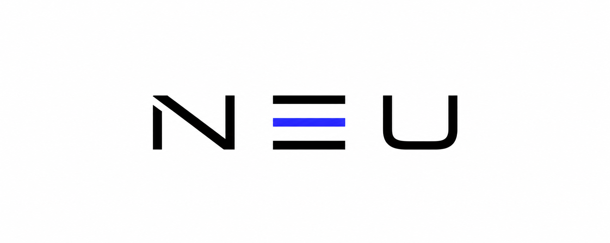

<p align="center">
  <picture>
    <source media="(prefers-color-scheme: dark)" srcset="assets/brand/neutralizer-black.png">
    <source media="(prefers-color-scheme: light)" srcset="assets/brand/neutralizer-white.png">
    
  </picture>
</p>

# NEUTRALIZER

NEUTRALIZER is a local, point-in-time oriented U.S. equity daily-bar database builder for survivorship-reduced backtesting.

It builds a local DuckDB database from reproducible collectors and keeps all raw/vendor data, parquet outputs, and database files outside Git. The repository stores only the pipeline, tests, documentation, and brand assets.

## Current Build Snapshot

Latest local build produced:

| Area | Value |
| --- | ---: |
| Final DuckDB | `data/pit_market.duckdb` |
| Daily price rows | 23,965,894 |
| Total symbols | 11,803 |
| Active-source symbols | 10,021 |
| Delisted-source symbols | 1,782 |
| Price date range | 2010-01-01 to 2026-06-11 |
| Universe date range | 2010-01-25 to 2026-06-09 |
| Universe memberships | 13,740,815 |
| Median daily universe count | 3,053 |

Security classification:

| Area | Value |
| --- | ---: |
| `security_master` symbols | 11,803 |
| Stock-classified symbols | 6,923 |
| ETF-classified symbols | 4,861 |
| Unknown/fund symbols | 19 |
| Sector/industry-enriched symbols | 184 |

SEC-led delisting discovery:

| Area | Value |
| --- | ---: |
| SEC Form 25/25-NSE filings | 28,144 |
| SEC delisting CIKs | 8,731 |
| SEC candidate tickers | 10,962 |
| Yahoo delisted raw cache inspected | 4,441 |
| Yahoo equity/ETF/USD cache accepted | 1,813 |
| Yahoo non-equity/non-USD/empty cache rejected | 2,628 |

Price-bar source coverage:

| Source | Rows | Symbols | Range |
| --- | ---: | ---: | --- |
| `yahoo_fallback` | 20,282,646 | 10,021 | 2010-01-04 to 2026-06-10 |
| `yahoo_delisted_probe` | 3,649,850 | 1,767 | 2010-01-04 to 2026-06-11 |
| `kaggle_arandkei_delisted` | 33,398 | 15 | 2010-01-01 to 2026-02-23 |

## What This Is

- A local PIT-style market database builder for daily backtests.
- A survivorship-reduced research database, not a CRSP-grade security master.
- A reproducible Python pipeline that writes Parquet and DuckDB.
- A daily-maintainable project structure with explicit source coverage reports.

## What This Is Not

- Not a complete CRSP, Norgate, Bloomberg, or Refinitiv replacement.
- Not a guarantee that every historical delisted U.S. security has been recovered.
- Not an intraday, options, fundamentals, or live trading system.

## Repository Layout

```text
assets/brand/               NEUTRALIZER CI assets
docs/                       Architecture, data dictionary, maintenance notes
scripts/                    Operator scripts
src/collectors/             Source collectors
src/normalize/              Canonical prices, symbol master, and security master
src/universe/               Liquidity metrics and daily universe
src/db/                     DuckDB build and query helpers
tests/                      Unit tests
data/                       Local-only generated data, ignored by Git
```

## Main Local Output

```text
data/pit_market.duckdb
```

Core tables:

| Table | Purpose |
| --- | --- |
| `daily_prices` | Canonical OHLCV daily bars |
| `symbol_master` | Source coverage and symbol ranges |
| `security_master` | Asset type, ETF flag, exchange, name, sector, and industry |
| `liquidity_metrics` | Dollar volume, ADV20, next open |
| `universe_membership` | Date-by-date backtest universe |
| `universe_stats` | Daily sanity metrics |

## Quick Start

Install dependencies:

```powershell
python -m pip install -r requirements.txt
```

Set local secrets:

```powershell
powershell -ExecutionPolicy Bypass -File .\scripts\setup_secrets.ps1
```

Check setup:

```powershell
python -m src.run_pipeline --step check
```

Run a full rebuild:

```powershell
python -m src.run_pipeline --start-date 2010-01-01 --end-date today
```

Run daily maintenance:

```powershell
powershell -ExecutionPolicy Bypass -File .\scripts\daily_maintenance.ps1
```

## Backtest Query Contract

Use `src/db/query_examples.py`:

```python
from src.db.query_examples import get_universe, get_prices, get_price_panel
from src.db.query_examples import get_security_master

symbols = get_universe("2020-01-02")
prices = get_prices("2020-01-02", symbols[:100])
panel = get_price_panel("2020-01-02", "2020-03-31")
metadata = get_security_master(symbols[:100])
```

## Source Model

NEUTRALIZER uses SEC as the primary delisting discovery spine. Price bars are then recovered from available historical-price sources.

| Layer | Source | Role |
| --- | --- | --- |
| Delisting discovery | SEC Form 25/25-NSE filings | Finds delisting events and issuer CIKs. |
| Ticker mapping | SEC Form 3/4/5 structured data | Maps CIKs to historical tickers where available. |
| Delisted OHLCV recovery | Yahoo chart API probe | Pulls daily bars for recoverable SEC candidate tickers. |
| Active OHLCV baseline | Yahoo chart API | Pulls current listed-symbol daily bars. |
| Supplemental delisted OHLCV | Kaggle Arandkei archive | Adds delisted historical bars available in the archive. |
| Metadata enrichment | FMP delisted metadata | Optional enrichment, limited by API plan. |
| Sector/industry enrichment | FMP profile metadata | Optional incremental profile cache, limited by API plan. |
| Supplemental OHLCV | Stooq bulk archive | Attempted when available; pipeline continues without it. |

Yahoo chart responses are accepted only when metadata identifies a USD `EQUITY` or `ETF`; non-equity, non-USD, and placeholder `YHD` matches are rejected before normalization.

## Maintenance

See:

- [Architecture](docs/ARCHITECTURE.md)
- [Data Dictionary](docs/DATA_DICTIONARY.md)
- [Daily Maintenance](docs/MAINTENANCE.md)
- [Coverage Notes](docs/COVERAGE.md)

## Validation

```powershell
python -m unittest discover -s tests
python -m src.tools.audit_daily_prices
```

Latest validation:

```text
Ran 11 tests
OK
```

## Data Policy

Generated market data, raw vendor/API responses, DuckDB files, and secrets are intentionally ignored by Git.

Do not commit:

- `.env.local`
- `data/pit_market.duckdb`
- `data/raw/**`
- `data/staging/**`
- `data/normalized/**`
- `data/research/**`
